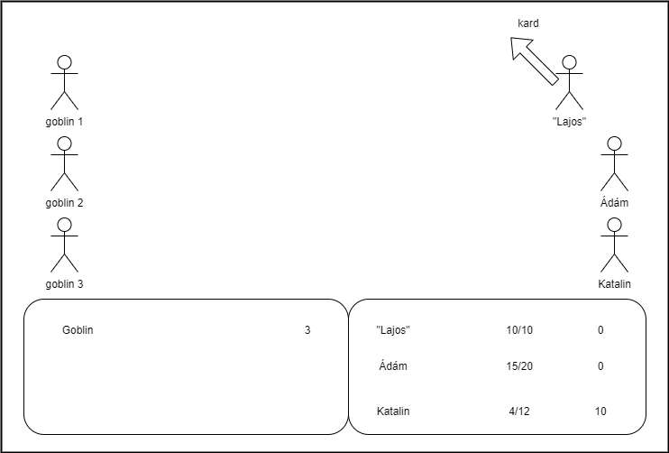

### Alapkoncepció
Az eredeti Final Fantasy egy levizezett verziója.
Rajz:

### Célzott platformok:
Számítógépes böngésző
### Irányítás:
Egérmutatóval
## Játékmenet:
 - Egy menüvel indít a játék, amin található egy "Start" és "Exit" gomb.
 - Start gombot megnyomva bedob minket a karakter képernyőre, ahol fegyvereket lehet választani, különböző sebzés típusokkal. (Tűz, jég, Koncepciós)
 - Miután kiválasztotta a játékos a teljes parti fegyverzetét,  bedob egy ütközetbe különböző lényekkel.
 - Különböző lényeknek különböző gyengeségei vannak. (pl: goblin gyenge a tűzre stb.)
 - Ha legyőzi őket, akkor pontokat kap, amikből jobb fegyvert vásárolhat.
 - Visszamegy a karakter képernyőre. (város, rejtekhely stb.)
 - Kezdődik előlről a karakter képernyőtől.
 - Ha a játékos elveszti a parti összes tagját, Game Over.
### Asset-ek:
- Hátterek (csatamező, menü, karakter képernyő)
- Fegyverek
- Ellenségek
- Karakterek
- Animációk (halál, támadás stb.)
 